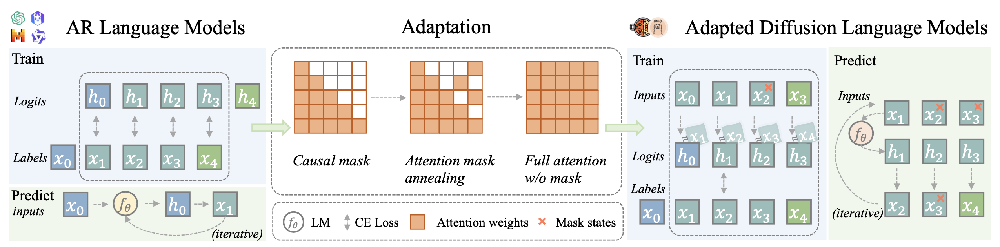
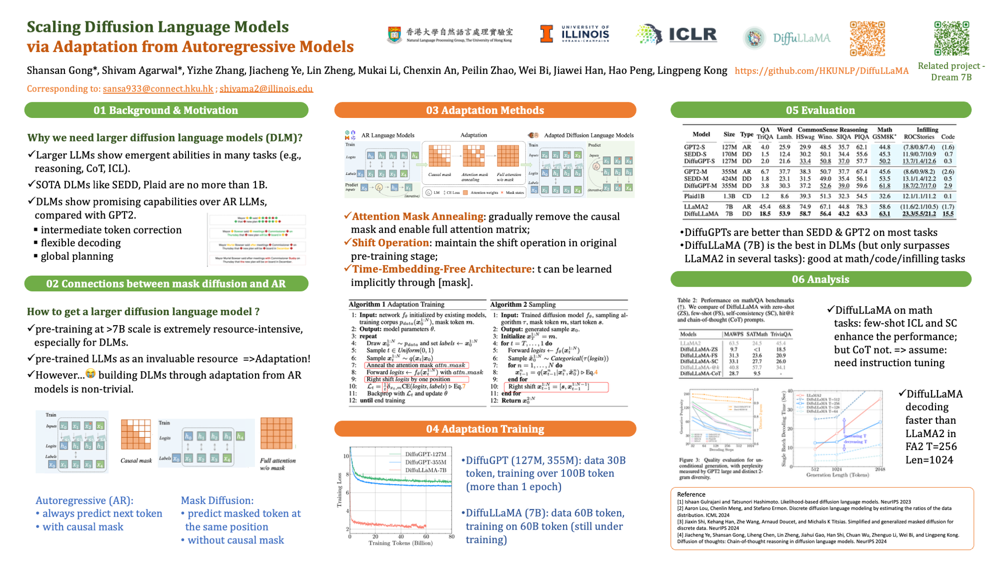

<p align="center" width="100%">

</p>

# DiffuLLaMA & DiffuGPT: Scaling Diffusion Language Models

[](https://huggingface.co/diffusionfamily)
[](https://arxiv.org/abs/2410.17891)


## Overview
Current Diffusion Language Models (DLMs) have been studied at a smaller scale compared to their autoregressive (AR) counterparts and lack fair comparison on language modeling benchmarks. Additionally, training diffusion models from scratch at scale remains challenging. We propose adapting existing AR models to build text diffusion models. We demonstrate connections between AR and diffusion modeling objectives and introduce a simple continual pre-training approach for training diffusion models.

Through systematic evaluation on language modeling, reasoning, and commonsense benchmarks, we show that we can convert AR models ranging from 127M to 7B parameters (GPT2 and LLaMA) into diffusion models **DiffuGPT** and **DiffuLLaMA**, using less than 200B tokens for training. Here we open-source adaptation code, efficient fine-tuning scripts, and evaluation toolkits.

<p align="center" width="100%">

</p>
<p align = "center">
The overview of adaptation process.
</p>

### ⌚️ Update 
- May 2025. Minor updates for paper and code (bug fixed). Checkout the latest dLLM [Dream-7B](https://hkunlp.github.io/blog/2025/dream/) from our lab. 🎉
- 19 Feb 2025. DiffuLLaMA has been accepted at ICLR2025! 🎉 Checkout our camera ready copy at [openreview](https://openreview.net/pdf?id=j1tSLYKwg8). We uploaded [LoRA adapater of DiffuLLaMA](https://huggingface.co/diffusionfamily/diffullama-gsm) finetuned on GSM8K-symbolic data.
- 22 Nov 2024. Update evaluation scripts.

### 📖 Setup
Basic environments:
```bash
python 3.11
transformers 4.44.2
torch 2.1.1+cu121
```
For quick start:
```bash
pip install -r LLaMA-Factory/requirements.txt
pip install flash-attn==2.6.3 --no-build-isolation
```
Flash-attention is not required, but we suggest to use for fast training/inference.
For training and finetuning, we provide our customed [LLaMA-Factory](https://github.com/hiyouga/LLaMA-Factory) based on `0.8.4.dev0`.

```bash
cd LLaMA-Factory
pip install -e ".[torch,metrics]"
```

> 📌 Note: We suggest you to set the HuggingFace cache_dir: `export HF_HOME=/path-to-huggingface/cache/`. For efficient inference, please install [flash-attention-2](https://github.com/Dao-AILab/flash-attention).


Explanation for folders
```bash
├── DiffuLLaMA-training/ # our code to adapt LLaMA2, implemented using transformers, considering that LLaMA-Factory is less efficient for pre-training
├── evaluation/ # evaluation scripts
├── example_output/ # some generation examples
├── LLaMA-Factory/ #  our code to adapt GPT, and LoRA finetuning
│   ├── src/llamafactory # integrate diffusion training in LLaMA-Factory
│   │   ├── train/ddm # main folder for diffusion training
│   │   ├── model/loader # loading models
│   │   ├── data/loader # loading data
│   │   ├── attention_patch.py # we modify the way to pass the attention_mask variable
│   ├── examples # config for diffusion training
├── attention_patch.py # we modify the way to pass the attention_mask variable
├── model.py # defined model for quick inference
├── inf_diffugpt.py # quick start inference
├── inf_diffullama.py # quick start inference
```

### 🚀 Quick Start
We provide the example code for inference and you can directly do some unconditional and conditional generation. 
```bash
### DiffuGPT-small inference example
python inf_diffugpt.py --model_name diffusionfamily/diffugpt-s --base_model_name gpt2
### DiffuGPT-medium inference example
python inf_diffugpt.py --model_name diffusionfamily/diffugpt-m --base_model_name gpt2-medium
### DiffuLLaMA inference example
python inf_diffullama.py --model_name diffusionfamily/diffullama  --flash_attn flash_attention_2
```

> 📌 Note: For `base_model_name` here, we will not download the original model but only use their config. For DiffuLLaMA, we support three types of attention: `eager`, `sdpa`, `flash_attention_2`. The output log can be seen at `./example_output/`.

### 💪 Adaptation Training
#### Prepare the data. 

We use pre-training corpus from [FineWeb](https://huggingface.co/datasets/HuggingFaceFW/fineweb), [TinyLLaMA](https://github.com/jzhang38/TinyLlama).

For DiffuGPT, the example of data processing is in `LLaMA-Factory/data/data_prepare.py`. We only use 30B tokens from this subset. 
```bash
python LLaMA-Factory/data/data_prepare.py
cat clean_00000.jsonl clean_00001.jsonl clean_00002.jsonl > fineweb-cc-24-0.jsonl
```
Add the following field to `LLaMA-Factory/data/dataset_info.json`.
```json
  "fineweb": {
    "file_name": "fineweb-cc-24-0.jsonl",
    "columns": {
      "prompt": "text"
    }
  }
```
We suggest to pre-tokenize the data, considering the training speed. Example: `LLaMA-Factory/examples/train_full/gpt2_preprocess.yaml`.

Considering the training efficiency, we choose not to use LLaMA-Factory for 7B pre-training. For DiffuLLaMA, please refer to `DiffuLLaMA-training`.

#### Start Training.
Use `llamafactory-cli` to start training, all configs are listed in `LLaMA-Factory/examples/`. If you want to use ZeRO, please install `deepspeed==0.15.0`.
```bash
cd LLaMA-Factory
export HF_HOME=yourpath
export WANDB_API_KEY=yourkey
# maybe export cuda path here

# FORCE_TORCHRUN=0 llamafactory-cli train examples/train_full/gpt2_preprocess.yaml
FORCE_TORCHRUN=1 llamafactory-cli train examples/train_full/gpt2_full_ddm.yaml
```

#### Inference.
You can do unconditional generation for adapted diffusion language models.
```bash
FORCE_TORCHRUN=1 llamafactory-cli train examples/inference/gpt2_full_ddm-inf.yaml
```
We can set sampling parameters using `logits_temp` (top-k temperature) and `diffusion_steps` (decoding steps).

### ⏳ Finetuning
For DiffuGPT and DiffuLLaMA, we can finetune them to achieve better downstream tasks. For finetuning setting, please use `stage: ddm-sft` instead of `stage: ddm` for pre-training. For `ddm-sft`, we use the way of [DiffuSeq](https://github.com/Shark-NLP/DiffuSeq) to do the diffusion finetuning.

An example of DiffuGPT training config is in `examples/train_full/gpt2_full_ddm-sft.yaml`. We explain some keywords:
```bash
model_name_or_path: gpt2-medium # path or model name to AR base model
checkpoint_dir: output/gpt2-ddm/checkpoint-160000/ # local path to diffugpt
dataset: gsm # the customed data should be registered in `LLaMA-Factory/data/dataset_info.json`
cutoff_len: 256 # No need to set it as the pre-training length
anneal_steps: 1 # Do not use attention anneal for finetune, because the base model is already using bi-directional attention.
shift: true
```

An example of DiffuLLaMA config is in `examples/train_lora/llama2_lora_ddm-sft.yaml`. 
```bash
model_name_or_path: output/llama2-ddm # local path to diffullama
finetuning_type: lora
lora_target: all # lora params
additional_target: embed_tokens # finetune word embedding
lora_rank: 16 # lora params
```

An example of DiffuLLaMA inference: `examples/inference/llama2_full_ddm-gsm-inf.yaml`.
```bash
adapter_name_or_path: output/llama2-ddm-gsm-v3/checkpoint-64000 # the path to saved lora adapter ckpt
```

> 📌 Note: If you skip the adaptation training and choose to use our released checkpoint to do the finetuning, please specify `checkpoint_dir` to the huggingface cache directory to these checkpoints, or using huggingface cli to download checkpoints to a local directory: `huggingface-cli download model-name --local-dir /a-local-path/`.

### 📏 Evaluation
We build the zero-shot evaluation, please call the function in `main`. For example:
```python
eval_hellaswag(model, tokenizer, args)
```
We also open-source the implementation of baseline models [Plaid](https://github.com/igul222/plaid/tree/main) and [SEDD](https://github.com/louaaron/Score-Entropy-Discrete-Diffusion/tree/main).

### 🙇 Acknowledgements
We sincerely appreciate the following people (works) for DiffuLLaMA:
- This work is built upon the [LLaMA2](https://ai.meta.com/llama) and GPT2 as the pre-trained models. We also use pre-training corpus from [FineWeb](https://huggingface.co/datasets/HuggingFaceFW/fineweb), [TinyLLaMA](https://github.com/jzhang38/TinyLlama).
- We implement training and LoRA tuning based on [LLaMAFactory](https://github.com/hiyouga/LLaMA-Factory).
- We thank [Tianxiao Shen](https://shentianxiao.github.io/) for discussion in the early stage of this project.
- We thank [Yu Zhang](https://github.com/yzhangcs) for engineering discussion on this work.

## Citation
```
@inproceedings{
    gong2025scaling,
    title={Scaling Diffusion Language Models via Adaptation from Autoregressive Models},
    author={Shansan Gong and Shivam Agarwal and Yizhe Zhang and Jiacheng Ye and Lin Zheng and Mukai Li and Chenxin An and Peilin Zhao and Wei Bi and Jiawei Han and Hao Peng and Lingpeng Kong},
    booktitle={The Thirteenth International Conference on Learning Representations},
    year={2025},
    url={https://openreview.net/forum?id=j1tSLYKwg8}
}
```

## License
- DiffuLLaMA & DiffuGPT is licensed under the Apache License 2.0. This means that it requires the preservation of copyright and license notices. 

<p align="center" width="100%">

</p>
<p align = "center">
ICLR 2025 Poster
</p>